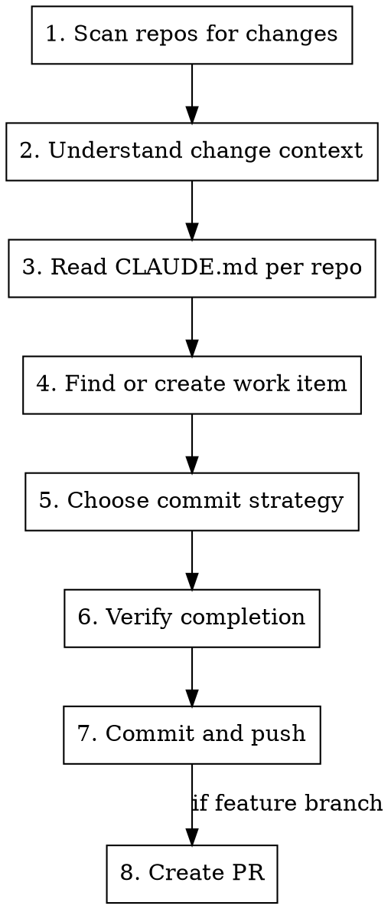

# octo-commit

Structured workflow for committing finished work across OctoMesh repositories with Azure DevOps work item linking, verification, and optional PR creation.

## Commit Message Format

```
AB#<WorkItemId> <New|Fix>: <Description>
```

| Work Item Type | Prefix | Example |
|---------------|--------|---------|
| Issue / Epic | `New` | `AB#4521 New: Add pipeline validation endpoint` |
| Bug | `Fix` | `AB#4493 Fix: Resolve null reference in CK compilation` |

**Description:** imperative mood, concise (e.g., "Add validation" not "Added validation").

## Branch Naming

| Workflow | Pattern | Example |
|----------|---------|---------|
| Feature branch | `dev/<username>/<feature-name>` | `dev/reimar/implement-skill` |
| Direct to main | no branch creation | only for small, confirmed low-risk changes |

Derive `<username>` from `git config user.name` (first name, lowercase). Derive `<feature-name>` from the work item title or change context (kebab-case).

## Workflow



---

### Step 1: Scan All Repos for Pending Changes

Find the monorepo root (directory containing `octo-tools/`) by walking up from the current working directory. Then scan every git repo for uncommitted changes:

```bash
# From the monorepo root
for dir in */; do
  if [ -d "$dir/.git" ]; then
    changes=$(git -C "$dir" status --porcelain 2>/dev/null)
    if [ -n "$changes" ]; then
      echo "=== $dir ==="
      echo "$changes"
    fi
  fi
done
```

Report ALL repos with changes. Do not skip any. Also check for unpushed commits:

```bash
git -C "$dir" log --oneline @{upstream}..HEAD 2>/dev/null
```

### Step 2: Understand Change Context

Gather context from (priority order):

1. **User's prompt** -- explicit description of the work
2. **Conversation history** -- what was discussed/implemented this session
3. **Git diffs** -- `git diff` and `git diff --staged` in each changed repo

If context is unclear, use **AskUserQuestion**:
> "I found changes in [repos]. Can you briefly describe what you worked on?"

### Step 3: Read CLAUDE.md for Each Changed Repo

For every repo with pending changes:

1. Read `<repo>/CLAUDE.md` if it exists
2. Note build commands, test commands, and conventions
3. Note the required build configuration (typically `DebugL` for OctoMesh .NET repos)

**IMPORTANT:** Follow repo-specific conventions from CLAUDE.md. They override defaults.

### Step 4: Find or Create Azure DevOps Work Item

**Azure DevOps context:** Organization `meshmakers`, Project `OctoMesh`.

**Resolution order:**

1. Check if user mentioned a work item ID (AB#1234, "work item 1234")
2. Check current branch name for clues (`dev/reimar/AB1234-feature`)
3. If unknown, analyze the changes and search Azure DevOps:

```bash
az boards work-item query \
  --wiql "SELECT [System.Id], [System.Title], [System.WorkItemType], [System.State] \
          FROM WorkItems \
          WHERE [System.TeamProject] = 'OctoMesh' \
          AND [System.Title] CONTAINS '<keyword>' \
          AND [System.State] <> 'Closed' \
          ORDER BY [System.ChangedDate] DESC" \
  --org https://dev.azure.com/meshmakers
```

Work item types: **Bug**, **Issue** (features), **Epic**.

Present matching work items to the user with AskUserQuestion if multiple matches found.

**If no matching work item exists**, ask user whether to create one. If yes, gather the following via AskUserQuestion:

1. **Type**: Bug, Issue, or Epic
2. **Team**: Product Team or Solution Team
3. **Area**: suggest based on which repos have changes
4. **Iteration**: list available iterations for the chosen team

```bash
# List available iterations for a team
az boards iteration team list \
  --team "<Team>" \
  --org https://dev.azure.com/meshmakers \
  --project OctoMesh

# List available areas for a team
az boards area team list \
  --team "<Team>" \
  --org https://dev.azure.com/meshmakers \
  --project OctoMesh
```

Create the work item:

```bash
az boards work-item create \
  --type "<Type>" \
  --title "<Title>" \
  --area "<AreaPath>" \
  --iteration "<IterationPath>" \
  --org https://dev.azure.com/meshmakers \
  --project OctoMesh
```

### Step 5: Choose Commit Strategy

Use **AskUserQuestion** if not already clear from context:

> "How should we handle this commit?"
> - **Direct to main** -- small, low-risk change
> - **Feature branch + PR** -- standard workflow

If feature branch:
- Create branch: `dev/<username>/<feature-name>`
- Derive username from `git config user.name` (first name, lowercase)
- Derive feature name from work item title or change context (kebab-case)

```bash
git -C <repo> checkout -b dev/<username>/<feature-name>
```

### Step 6: Verify Completion

Before committing, verify the work is ready. For each changed repo, check based on its CLAUDE.md:

**For .NET repos:**
```bash
dotnet build <solution>.sln --configuration DebugL
dotnet test <solution>.sln --configuration DebugL
```

**For Angular/frontend repos:**
```bash
npm run lint
npm test -- --watch=false
```

If build or tests fail, use **AskUserQuestion**:
> "Build/tests failed in [repo]: [error summary]. Fix first, or proceed anyway?"

For significant changes, ask about documentation:
> "Does this change need documentation updates?"

### Step 7: Commit and Push

Build the commit message using the format `AB#<id> <New|Fix>: <Description>`.

**Before committing**, show the user what will happen via **AskUserQuestion**:

> Ready to commit:
> - **Repo:** [repo-name]
> - **Message:** `AB#1234 New: Add pipeline validation`
> - **Files:** [file list or summary]
> - **Branch:** main / dev/reimar/feature-name

For each repo with changes:

```bash
# Stage changes (prefer specific files over -A when possible)
git -C <repo> add <specific-files>

# Commit with heredoc for proper formatting
git -C <repo> commit -m "$(cat <<'EOF'
AB#<id> <New|Fix>: <Description>

Co-Authored-By: Claude <noreply@anthropic.com>
EOF
)"

# Push
git -C <repo> push -u origin <branch>
```

**NEVER force-push to main.** Always confirm before pushing.

### Step 8: Create PR (if feature branch)

**For GitHub repos** (majority of OctoMesh repos):

```bash
gh pr create \
  --repo meshmakers/<repo-name> \
  --title "AB#<id> <New|Fix>: <Description>" \
  --body "$(cat <<'EOF'
## Summary
- <bullet points of changes>

## Azure DevOps Work Item
AB#<id>

## Test Plan
- [ ] Build passes (DebugL)
- [ ] Unit tests pass
- [ ] Integration tests pass
- [ ] Manual verification done

Generated with [Claude Code](https://claude.ai/code)
EOF
)"
```

**For Azure DevOps repos** (e.g., meshmakers_staging):

```bash
az repos pr create \
  --repository <repo-name> \
  --source-branch <branch> \
  --target-branch main \
  --title "AB#<id> <New|Fix>: <Description>" \
  --org https://dev.azure.com/meshmakers \
  --project OctoMesh
```

Report the PR URL(s) to the user when done.

---

## Multi-Repo Commits

When changes span multiple repos:

1. Use the **same work item ID** and **same commit message prefix** across all repos
2. Commit repos in dependency order (consult CLAUDE.md for build order)
3. Push all repos before creating PRs
4. Cross-reference PRs in their descriptions when related

## Repo Remotes Quick Reference

| Repo | Host | PR Tool |
|------|------|---------|
| Most `octo-*` repos | GitHub (`meshmakers/`) | `gh pr create` |
| `meshmakers_staging` | Azure DevOps | `az repos pr create` |
| `pipeline-editor`, `docs` | GitHub (`reikla/`) | `gh pr create --repo reikla/<name>` |

## Common Mistakes

| Mistake | Prevention |
|---------|------------|
| Committing without work item | Always resolve AB# first -- search or create |
| Wrong prefix (New vs Fix) | Check work item type: Bug -> Fix, Issue/Epic -> New |
| Forgetting Co-Authored-By | Template includes it -- never remove |
| Not reading CLAUDE.md | Always read before build/test/commit |
| Committing secrets | Review staged files for .env, credentials, tokens |
| Force-pushing to main | Never. Use feature branches for risky changes |
| Skipping tests | Run tests per CLAUDE.md before every commit |
| Wrong build config | OctoMesh .NET repos require `DebugL`, not `Debug` or `Release` |
| Stale branch | Pull latest before branching: `git pull --rebase` |

## Red Flags -- STOP and Verify

- About to commit without an AB# work item link
- Pushing directly to main on a non-trivial change
- Tests not run or failing
- Changes in repos you haven't read CLAUDE.md for
- Sensitive files in the staging area (.env, appsettings with secrets)
