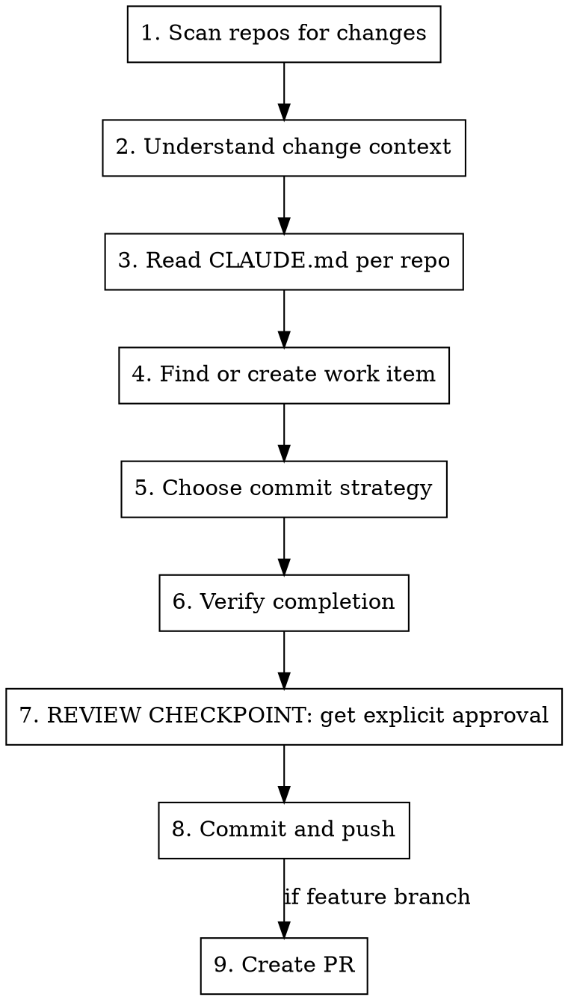

# octo-commit

Structured workflow for committing finished work across OctoMesh repositories with Azure DevOps work item linking, verification, and optional PR creation.

## CRITICAL: Review Checkpoint Before Pushing

**Never push or create a PR without explicit user approval given in the CURRENT session.** This is a firm convention from the repo owner.

- Implementation latitude (permission to write code) does NOT imply push authority.
- Statements like "I'll look at it later", "Ich schau's mir später an", "let me review first" mean **STOP** — do not push, do not open a PR. The user is taking a review checkpoint *before* the push.
- Committing locally may be fine when asked; **pushing and PR creation always require a fresh, explicit go-ahead** ("push it", "create the PR", "ship it").
- When in doubt, ask via **AskUserQuestion** before any `git push` / `gh pr create` / `az repos pr create`.

## Commit Message Format

```
AB#<WorkItemId> <New|Fix>: <Description>
```

| Work Item Type | Prefix | Example |
|---------------|--------|---------|
| Issue / Epic | `New` | `AB#4521 New: Add pipeline validation endpoint` |
| Task | `New` (default) | `AB#4081 New: Add blueprint variables` |
| Bug | `Fix` | `AB#4493 Fix: Resolve null reference in CK compilation` |

`New` and `Fix` cover the overwhelming majority of OctoMesh commits. **Task** has no distinct prefix convention in the git history — default to `New` and confirm the prefix with the user if the change is clearly a correction (then `Fix`).

**Description:** imperative mood, concise (e.g., "Add validation" not "Added validation").

## Branch Naming

Per the [meshmaker Development Guidelines](https://dev.azure.com/meshmakers/OctoMesh/_wiki/wikis/OctoMesh.wiki/141/Development-Guidelines-for-meshmaker-Teams):

| Workflow | Pattern | Example | Build on push? |
|----------|---------|---------|----------------|
| User-specific branch (default) | `<username>/AB#<wi-id>_<short_meaningful_description>` | `reimar/AB#1234_implement-skill` | No — only on PR |
| Long-running feature branch | `dev/AB#<wi-id>_<short_meaningful_description>` | `dev/AB#1234_implement-skill` | Yes — every push |
| Direct to main | no branch creation | only for small, confirmed low-risk changes | — |

Default to the **user-specific** pattern unless the user asks for a long-running feature branch (which triggers a build on every push). Derive `<username>` from `git config user.name` (first name, lowercase). `<wi-id>` is the Azure DevOps work item id. Derive `<short_meaningful_description>` from the work item title or change context (kebab-case, no spaces).

## Workflow


```dot
digraph commit_flow {
    rankdir=TB;
    node [shape=box];

    scan [label="1. Scan repos for changes"];
    context [label="2. Understand change context"];
    claudemd [label="3. Read CLAUDE.md per repo"];
    workitem [label="4. Find or create work item"];
    strategy [label="5. Choose commit strategy"];
    verify [label="6. Verify completion"];
    approve [label="7. REVIEW CHECKPOINT: get explicit approval"];
    execute [label="8. Commit and push"];
    pr [label="9. Create PR"];

    scan -> context -> claudemd -> workitem -> strategy -> verify -> approve -> execute;
    execute -> pr [label="if feature branch"];
}
```

---

### Step 1: Scan All Repos for Pending Changes

Find the monorepo root (directory containing `octo-tools/`) by walking up from the current working directory. Then scan every git repo for uncommitted changes:

```bash
# From the monorepo root
for dir in */; do
  if [ -d "$dir/.git" ]; then
    changes=$(git -C "$dir" status --porcelain 2>/dev/null)
    if [ -n "$changes" ]; then
      echo "=== $dir ==="
      echo "$changes"
    fi
  fi
done
```

Report ALL repos with changes. Do not skip any. Also check for unpushed commits:

```bash
git -C "$dir" log --oneline @{upstream}..HEAD 2>/dev/null
```

### Step 2: Understand Change Context

Gather context from (priority order):

1. **User's prompt** -- explicit description of the work
2. **Conversation history** -- what was discussed/implemented this session
3. **Git diffs** -- `git diff` and `git diff --staged` in each changed repo

If context is unclear, use **AskUserQuestion**:
> "I found changes in [repos]. Can you briefly describe what you worked on?"

### Step 3: Read CLAUDE.md for Each Changed Repo

For every repo with pending changes:

1. Read `<repo>/CLAUDE.md` if it exists
2. Note build commands, test commands, and conventions
3. Note the required build configuration (typically `DebugL` for OctoMesh .NET repos)

**IMPORTANT:** Follow repo-specific conventions from CLAUDE.md. They override defaults.

### Step 4: Find or Create Azure DevOps Work Item

**Azure DevOps context:** Organization `meshmakers`, Project `OctoMesh`.

**Resolution order:**

1. Check if user mentioned a work item ID (AB#1234, "work item 1234")
2. Check current branch name for clues (`reimar/AB#1234_feature`)
3. If unknown, analyze the changes and search Azure DevOps with a WIQL query:

```bash
az boards query \
  --wiql "SELECT [System.Id], [System.Title], [System.WorkItemType], [System.State] \
          FROM WorkItems \
          WHERE [System.TeamProject] = 'OctoMesh' \
          AND [System.Title] CONTAINS '<keyword>' \
          AND [System.State] <> 'Closed' \
          ORDER BY [System.ChangedDate] DESC" \
  --org https://dev.azure.com/meshmakers
```

**CRITICAL:** The WIQL command is `az boards query` — there is **no** `az boards work-item query` subcommand (`az boards work-item` only has create/delete/show/update).

Work item types: **Bug**, **Issue** (features), **Epic**, **Task**.

Present matching work items to the user with AskUserQuestion if multiple matches found.

**If no matching work item exists**, ask user whether to create one. If yes, gather the following via AskUserQuestion:

1. **Type**: Bug, Issue, Epic, or Task
2. **Team**: one of the real OctoMesh teams (see below)
3. **Area**: suggest based on which repos have changes
4. **Iteration**: list available iterations for the chosen team

**OctoMesh Azure DevOps teams** (use the exact names):
`Solutions Team` (plural), `Product Team`, `CustomerProjects Team`, `Sales Team`, `BizOps Team`, `Energy Solution Team`.

```bash
# List available iterations for a team
az boards iteration team list \
  --team "Solutions Team" \
  --org https://dev.azure.com/meshmakers \
  --project OctoMesh

# List available areas for a team
az boards area team list \
  --team "Solutions Team" \
  --org https://dev.azure.com/meshmakers \
  --project OctoMesh
```

Create the work item (Mutating — confirm with user first):

```bash
az boards work-item create \
  --type "<Type>" \
  --title "<Title>" \
  --area "<AreaPath>" \
  --iteration "<IterationPath>" \
  --org https://dev.azure.com/meshmakers \
  --project OctoMesh
```

### Step 5: Choose Commit Strategy

Use **AskUserQuestion** if not already clear from context: **Direct to main** (small, low-risk) or **Feature branch + PR** (standard).

For a feature branch, create it using the Branch Naming convention above:

```bash
git -C <repo> checkout -b <username>/AB#<wi-id>_<short_meaningful_description>
```

### Step 6: Verify Completion

Before committing, verify the work is ready. For each changed repo, check based on its CLAUDE.md:

**For .NET repos:**
```bash
dotnet build <solution>.sln --configuration DebugL
dotnet test <solution>.sln --configuration DebugL
```

**For Angular/frontend repos:**
```bash
npm run lint
npm test -- --watch=false
```

If build or tests fail, use **AskUserQuestion**:
> "Build/tests failed in [repo]: [error summary]. Fix first, or proceed anyway?"

For significant changes, ask about documentation:
> "Does this change need documentation updates?"

### Step 7: Review Checkpoint — Get Explicit Approval

Before any `git push` / `gh pr create` / `az repos pr create`, you must have explicit approval **in the current session**. Show the user what will happen via **AskUserQuestion**:

> Ready to commit and push:
> - **Repo:** [repo-name]
> - **Message:** `AB#1234 New: Add pipeline validation`
> - **Files:** [file list or summary]
> - **Branch:** main / reimar/AB#1234_feature-name
> - **Will push + open PR:** yes/no

If the user defers ("I'll look at it later"), STOP — you may commit locally only if explicitly asked, but do **not** push or open a PR.

### Step 8: Commit and Push

Build the commit message using the format `AB#<id> <New|Fix>: <Description>`.

**Co-Authored-By convention:** OctoMesh repos use a **model-specific** trailer of the form
`Co-Authored-By: Claude <model name> <noreply@anthropic.com>` — not a bare `Claude`. Use the
running model's name, e.g. `Co-Authored-By: Claude Opus 4.8 (1M context) <noreply@anthropic.com>`.

For each repo with changes:

```bash
# Stage changes (prefer specific files over -A when possible)
git -C <repo> add <specific-files>

# Commit with heredoc for proper formatting
git -C <repo> commit -m "$(cat <<'EOF'
AB#<id> <New|Fix>: <Description>

Co-Authored-By: Claude Opus 4.8 (1M context) <noreply@anthropic.com>
EOF
)"

# First push of a new branch MUST set upstream with -u
git -C <repo> push -u origin <branch>

# Subsequent pushes (upstream already set)
git -C <repo> push
```

**CRITICAL:** The initial push of a freshly created feature branch requires `-u`
(`git push -u origin <branch>`) to set the upstream tracking ref; later pushes can use a bare `git push`.

**NEVER force-push to main.** Always confirm before pushing (see Review Checkpoint).

### Step 9: Create PR (if feature branch)

**For GitHub repos** (majority of OctoMesh repos):

```bash
gh pr create \
  --repo meshmakers/<repo-name> \
  --title "AB#<id> <New|Fix>: <Description>" \
  --body "$(cat <<'EOF'
## Summary
- <bullet points of changes>

## Azure DevOps Work Item
AB#<id>

## Test Plan
- [ ] Build passes (DebugL)
- [ ] Unit + integration tests pass
- [ ] Manual verification done

Generated with [Claude Code](https://claude.ai/code)
EOF
)"
```

**For Azure DevOps repos** (e.g., `meshmakers_staging`). Use `--work-items` to link the PR
directly to the ADO work item (space-separated IDs):

```bash
az repos pr create \
  --repository <repo-name> \
  --source-branch <branch> \
  --target-branch main \
  --title "AB#<id> <New|Fix>: <Description>" \
  --work-items <id> \
  --org https://dev.azure.com/meshmakers \
  --project OctoMesh
```

Report the PR URL(s) to the user when done.

---

## Multi-Repo Commits

When changes span multiple repos:

1. Use the **same work item ID** and **same commit message prefix** across all repos
2. Commit repos in dependency order (consult CLAUDE.md for build order)
3. Push all repos before creating PRs
4. Cross-reference PRs in their descriptions when related

## Repo Remotes Quick Reference

Most `octo-*` repos live at `meshmakers/<repo>` on GitHub (`gh pr create`). `meshmakers_staging`
is the sole Azure DevOps-hosted repo (`az repos pr create`). `pipeline-editor`, `docs`,
`zenon-dynprop-api`, and `aspire-management-prototype` are under `reikla/` on GitHub.

**CRITICAL:** The local directory `docs` maps to the GitHub repo `reikla/ai-docs` (NOT `reikla/docs`).
If unsure of a repo's remote, verify before pushing: `git -C <repo> remote get-url origin`.

See `${CLAUDE_PLUGIN_ROOT}/skills/octo-commit/references/repo-remotes.md` for the full directory-to-remote table.

## Common Mistakes

| Mistake | Prevention |
|---------|------------|
| Pushing without approval | Get explicit go-ahead **this session** before any push/PR |
| Committing without work item | Always resolve AB# first -- search or create |
| Wrong WIQL command | Use `az boards query --wiql`, NOT `az boards work-item query` |
| Wrong prefix (New vs Fix) | Bug -> Fix; Issue/Epic/Task -> New (confirm Task if it's a fix) |
| Wrong team name | It's `Solutions Team` (plural), not "Solution Team" |
| Bare Co-Authored-By | Use model-specific name: `Claude <model> <noreply@anthropic.com>` |
| Wrong docs remote | `docs` dir -> `reikla/ai-docs`, not `reikla/docs` |
| Missing upstream on new branch | First push needs `git push -u origin <branch>` |
| Not reading CLAUDE.md | Always read before build/test/commit |
| Committing secrets | Review staged files for .env, credentials, tokens |
| Force-pushing to main | Never. Use feature branches for risky changes |
| Wrong build config | OctoMesh .NET repos require `DebugL`, not `Debug` or `Release` |
| Stale branch | Pull latest before branching: `git pull --rebase` |

## Red Flags -- STOP and Verify

- **About to push or open a PR without explicit approval in the current session** — STOP. "I'll look at it later" means do not push.
- About to commit without an AB# work item link
- Pushing directly to main on a non-trivial change
- Tests not run or failing
- Changes in repos you haven't read CLAUDE.md for
- Sensitive files in the staging area (.env, appsettings with secrets)
- Pushing a new branch without `-u` (upstream not set)
